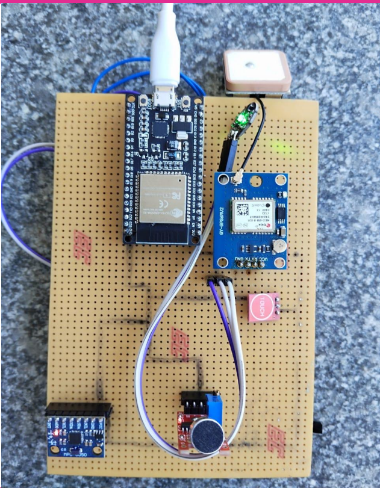

# smart-safety-band-esp32
IoT-based smart safety wearable using ESP32 with GPS tracking, fall detection, and emergency alert system

## Overview

This project is an IoT-based smart wearable designed to enhance safety for elderly people, women, and children.

## Objective

* Detect falls using accelerometer and gyroscope
* Track real-time location using GPS
* Send emergency alerts during unsafe situations
* Provide safety features like SOS trigger

## Components Used

* ESP32 Development Board
* GPS Module (NEO-6M)
* MPU6050 (Accelerometer + Gyroscope)
* Touch Sensor (SOS trigger)
* Sound Sensor (optional)

## Working Principle

* MPU6050 continuously monitors acceleration
* Sudden high acceleration → fall detection
* GPS provides real-time location
* Touch sensor triggers manual SOS alert
* Data is processed using ESP32

## Features

* Fall detection system
* Real-time GPS tracking
* Emergency SOS trigger
* Wearable safety device

## Hardware Setup

## Applications

* Elderly monitoring system
* Women safety device
* Child tracking system

## Future Improvements

* Mobile app integration (Firebase)
* SMS alert system
* Voice communication module
## Pin Configuration

| Component    | ESP32 Pin |
| ------------ | --------- |
| GPS RX       | GPIO16    |
| GPS TX       | GPIO17    |
| MPU6050 SDA  | GPIO21    |
| MPU6050 SCL  | GPIO22    |
| Touch Sensor | GPIO4     |

## Code Explanation

* GPS module reads real-time location using UART communication
* MPU6050 detects sudden acceleration changes (fall detection)
* Touch sensor acts as manual SOS trigger
* ESP32 processes data and outputs alerts via Serial Monitor
